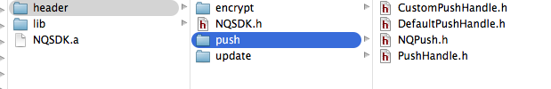
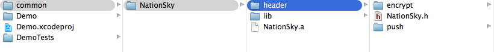
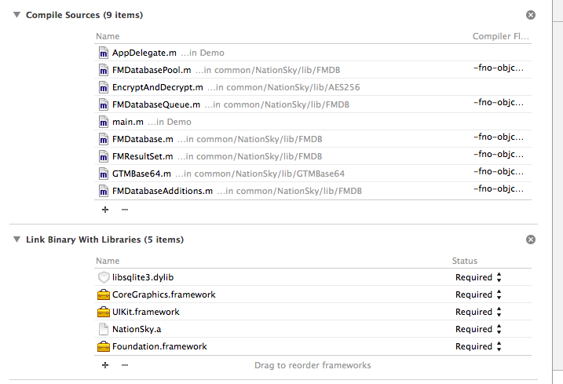
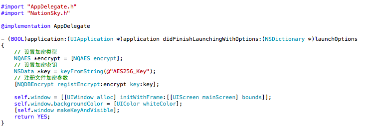

# sdk原理说明文档

### sdk服务原理流程

1. 用户上传sdk.zip ( 项目 + 配置文件 )
2. 后台服务器存储项目, 并且将配置文件内容存储到数据库
3. 当用户用到下载服务时, 前端会去后台服务器获取配置文件展现界面
4. 用户需填写sdk配置项, 以便将配置项的所有信息补充完成
5. 用户点击下载, 前端会将配置信息返回给后台, 而后台将该应用sdk服务的所有配置数据合并为一个Json进行sdk打包
6. 当sdk打包完成, 前端就可以提供一个下载链接
7. 下载sdk, 加入项目使用
 
### 如何上传sdk

1. 开发人员制作sdk
*  根据需求填写配置文件, 将sdk打成静态包
*  修改目录结构, 上传目录压缩后的Zip压缩包

**上传的Zip压缩包目录结构**

* header
	* sdk.h
	* *.h
* sdk.a
* sdk_config.txt

|     目录名称    |      目录描述          |
|----------------|----------------------|
|     header     |  将sdk头文件存放目录    |
|     sdk.a      |   sdk静态包           |
| 		 lib        |  	   sdk依赖文件        |
| sdk_config.txt |  用户填写完成后的配置文件 |

**example:**


##### 如何配置需要上传的配置文件

在上传文件的流程中, 有一个配置文件sdk_config.txt. 它需要配置如下内容   

```
{
    "sdk_name": "update",                        // sdk文件夹名称
    "main_header": "NQUpdate.h",                 // sdk引入文件的头文件
    "lib": [],                                   // 依赖文件的库
    "web_config": [                              // web页面展示需要的参数              
        {                                        // 每一个{}对应着一项使用者在页面上需要输入的参数
            "lable_text": "更新服务器链接",        // 展示参数的名称
            "tag": "input",                      // html中input输入的标签名
            "tag_type": "text",                  // input标签名称的类型
            "name": "update_url",                // 字段名称
            "value": "http: //www.baidu.com",    // 字段值(此项为空, 上传者无需填写)
            "value_type": "String",              // 字段类型
            "isDefine": 1,                       // 是否需要最终sdk.h中写入
            "define_Key": "UPDATE_URL"           // isDefine=1时生效,  sdk.h中将写入 define UPDATE_URL value
        }
    ]
}
```

**`注意: `** 上传的配置文件内容会上传到后台服务器, 存入数据库. 因此,上传的配置文件请务必确认正确. 否则会影响使用者的正常使用

#### html前端如何通过配置信息展示界面

每一个sdk在前端展示配置项都依赖着配置文件中的`web_config`, 而配置文件在服务器, 因此需要进行请求来获取所需要的配置信息

```
"web_config": [                                  // web页面展示需要的参数              
        {                                        // 每一个{}对应着一项使用者在页面上需要输入的参数
            "lable_text": "更新服务器链接",        // 展示参数的名称
            "tag": "input",                      // html中input输入的标签名
            "tag_type": "text",                  // input标签名称的类型
            "name": "update_url",                // 字段名称
            "value": "http: //www.baidu.com",    // 字段值(此项为空, 上传者无需填写)
            "value_type": "String",              // 字段类型
            "isDefine": 1,                       // 是否需要最终sdk.h中写入
            "define_Key": "UPDATE_URL"           // isDefine=1时生效,  sdk.h中将写入 define UPDATE_URL value
        }
```

**如何通过配置文件形成HTML** 

|  web_config字段名  |   字段描述          |
|-------------------|--------------------|
|    label_text     | 输入的信息描述       |
|    tag            | html中应该插入的标签 |
|    tag_type       | html插入标签的类型   |  
|    value          | 输入框的最终输入值    |
|	   name           |  上传数据的参数名    |

通过配置的以上字段, html就可以完成整个前端展示的工作

#### 服务器组合配置文件信息后如何打包sdk

当用户选择下载的时候, 后台会将用户配置的信息都合成一个最终的配置文件发送给另外一个服务器( 该服务器专门处理sdk合成服务 )

**获取的Json配置信息格式**

```
{
	sdk:{
		"sdk_list":[
			{
				sdk_配置信息
			},
			{
				sdk_配置信息
			}
		]
	}
	"output_name": "NQSDK",
	"app_id": "/Users/andy/desktop/output"
	"app_version_id": "/Users/andy/desktop/output"
}
```

sdk合成脚本会通过上述Json结构进行合成sdk.

**Json配置信息都影响了哪些操作**

1. sdk_list: sdk配置信息数组, 每一个配置项都会影响到需要获取哪些配置sdk, 影响sdk.h头文件的配置信息
*  output_name: 输出sdk的名称, 它影响sdk.h的文件名
*  app_id: 服务器数据库服务应用Id, 部分sdk需要配置该参数 `(默认输入sdk.h头文件中)`
*  app_version_id是服务器服务应用版本Id, 部分sdk需要配置该参数`(默认输入sdk.h头文件中)`


##### 如何将多个.a合成一个.a文件

由于每一个.a文件都是由多个cpu架构组成的, 想要合成就先进行分解处理

	lipo sdk.a -thin cpu -output cpu.a;

| cpu样式 |
|--------|
| arm64  |
| armv7  |
| armv7s |
| i386   |
| x86_64 |

然后将分解的独立的cpu再分解成.o文件

	ar x cpu.a

将所有cpu对应的.o放在一起, 合成一个独立cpu的.a文件

	ar cr cpu.a *.o
	
最后将多个对应cpu的.a合成最终的.a文件

	lipo -create sdk1.a sdk2.a -output res_sdk.a
	
**结构参考下列格式**

* res_sdk.a
	* arm64.a
		* a.o
		* b.o
		* c.o
	* armv7.a
		* a.o
		* b.o
		* c.o
	* armv7s.a
		* a.o
		* b.o
		* c.o
	* i386.a
		* a.o
		* b.o
		* c.o
	* x86_64.a
		* a.o
		* b.o
		* c.o	

##### 完成脚本生成的的Zip压缩包目录结构

* header
	* sdk.h
	* *.h
* lib
* sdk.a

|     目录名称    |      目录描述           |
|----------------|-----------------------|
|     header     |   sdk头文件存放的目录    |
|     sdk.a      |   项目可用的sdk静态包    |
| 		 lib        |  	   sdk依赖文件        |

**example:**



#### 如何下载sdk

1. 登录服务项选择所需的服务sdk
2. 填写各个sdk的配置项信息
3. 点击确认, 下载sdk

**`注意:`**  填写sdk配置信息时, 请务必填写正确信息. 如果输入有误, 将会导致导出sdk不可用.

##### 如何在项目中使用sdk

**首先, 将sdk直接加入项目**



**然后, 根据sdk文档添加依赖库**



**最后, 引入sdk.h即可使用配置的所注册的所有sdk功能**



